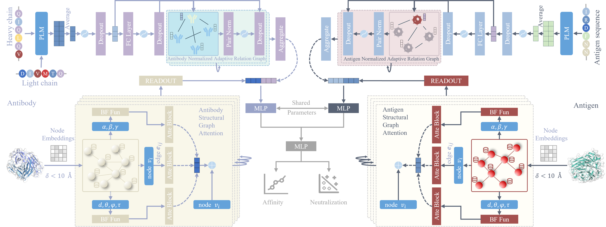

# MuLAAIP: Multi-Modality Representation Learning for Antibody-Antigen Interaction Prediction



This repository contains the official implementation of **MuLAAIP**, a novel deep learning framework for predicting antibody-antigen interactions (AAI) by integrating **3D structural** and **1D sequence** data. Our approach addresses critical challenges in AAI prediction, including structural data scarcity, sequence-structure dependency modeling, and imbalanced label distributions.

## 📁 Benchmark Datasets  

### Dataset Summary  
| Dataset | Type | Samples | Description |  
|--------|------|---------|-------------|  
| **Wild-type/Mutant-type Affinity** | Affinity Labeling | 1,191 / 1,742 pairs | Antibody-antigen binding affinity|  
| **Alphaseq** | Affinity Labeling | 248k antibodies | Antibody-antigen binding affinity |  
| **SARS-CoV-2 Neutralization** | Binary Classification | 310 pairs (228+/82-) | Neutralization activity labels |  

> All missing experimental structures were predicted using **ESMFold** (https://github.com/facebookresearch/esm).  

## 📥 Data Acquisition  

### Download Instructions  
1. **Get Data**:  
   [Baidu Cloud Link (Password: iuqs)](https://pan.baidu.com/s/1HqXfAUIjGp6h1gh3M2Pa8Q )  
 

## Installation
```bash
# Clone the repo
git clone https://github.com/trashTian/MuLAAIP.git 
cd MuLAAIP

# Install dependencies
pip install -r requirements.txt
```


## Cite this work
```
@article{guo2025multi,
  title={Multi-Modality Representation Learning for Antibody-Antigen Interactions Prediction},
  author={Guo, Peijin and Li, Minghui and Pan, Hewen and Huang, Ruixiang and Xue, Lulu and Hu, Shengqing and Guo, Zikang and Wan, Wei and Hu, Shengshan},
  journal={arXiv preprint arXiv:2503.17666},
  year={2025}
}
```


